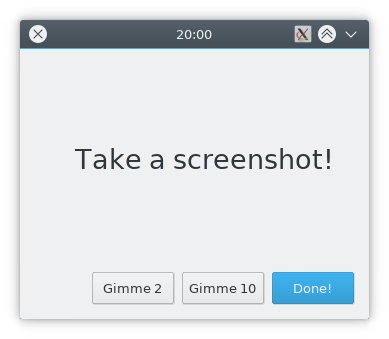

```bash
$ qmake && make
$ cat > example.txt
20:00 "Take a screenshot!"
23:45 "Go to bed, you big dummy!"
00:00 `systemctl suspend`
remind 2 10
$ ./routine example.txt &
```

One minute granularity, input file is re-read each time.



------

#### Q: Why?

A: My brain is bad. The only way I can make decisions, and make them stick, is by externalizing them. This helps.

#### Q: Why not cron, systemd, ...?

A: My brain is bad and computers are bad. A year ago, I spent some time trying to do a part of this (the `systemctl suspend` part) the Officially Recommended Way, which was apparently systemd timers. It didn't work. Ever since, I've been burned out on attempting to troubleshoot why. Writing a small program in a framework I know well is something I can do with 0% chance of failure.
